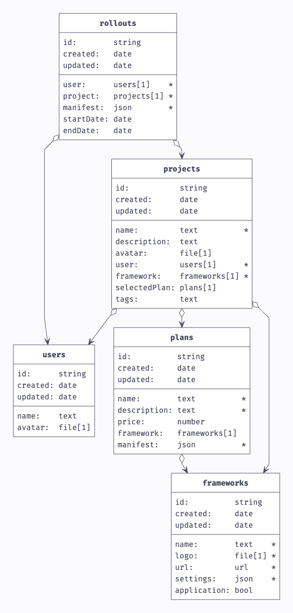

# Backend

## Pocketbase

<https://pocketbase.io/>

We utilized PocketBase as our primary backend tool and expanded its capabilities to interact with Kubernetes. This integration aimed at leveraging the simplicity and agility of PocketBase with the robust, scalable infrastructure provided by Kubernetes.

### What is Pocketbase?

PocketBase is a simple yet powerful backend solution, offering an easy-to-use database and real-time APIs. It stands out for its lightweight nature and flexibility, making it an excellent choice for projects requiring quick development and deployment.

### Hooks

PocketBase offers a set of hooks that can be used to execute custom code before or after certain events. We used these hooks to interact with Kubernetes and deploy our applications.

<https://pocketbase.io/docs/go-overview/>

**Kubernetes Integration via Hooks**: We extended PocketBase's functionality by creating custom hooks. These hooks are designed to communicate with the Kubernetes API, allowing us to deploy and manage Custom Resource Definitions (CRDs) from the [Kubernetes Operator](kubernetes-operator.md) directly from PocketBase. This integration enables seamless synchronization between our data management in PocketBase and the scalable deployment capabilities of Kubernetes.

### Collection Schema

<https://pocketbase-uml.github.io/>

*The schema image should illustrate the layout and relationships of the data collections used in PocketBase, showing how they are structured to facilitate the integration with Kubernetes.*

### Build

The pocketbase-backend will also serve the static html, css and js files from the [Frontend](frontend.md) of the project. The build process of this whole stack is done in a Dockerfile and automatically triggered via a GitHub Action on Release. The Dockerfile is located in the `ui` directory.

### Deployment

The deployment of this whole stack is done via a simple statefulset inside Kubernetes. Make sure the service account has the correct permissions to deploy applications to Kubernetes. The deployment files are located in the `deployment` directory.
