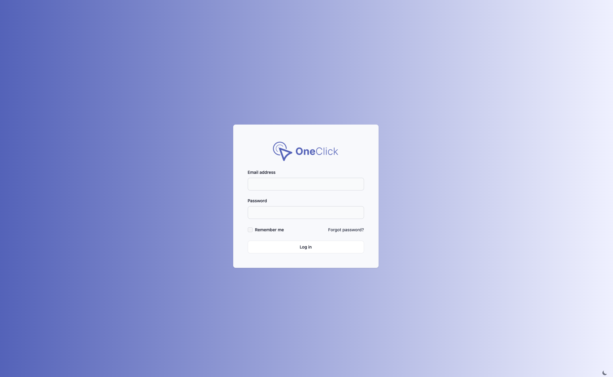

# Frontend

## Mockups

### Introduction

In this section we will show you the mockups for the frontend of the application.
It is important to note that these mockups are not final and will change over time.

For the mockups we used Figma, which is a tool for creating mockups and prototypes.

!!! note "Figma"
    You can find the mockups here:  
    [Figma Design File](https://www.figma.com/file/Bi4OKCqGSgPXN1tvFzVV6Q/Untitled?type=design&mode=design&t=Sv1KYLH6X63M3oaV-1)

### Mockups

#### Login Page

#### Overview Page

#### Project Page

#### Profile Page

#### Settings Page
